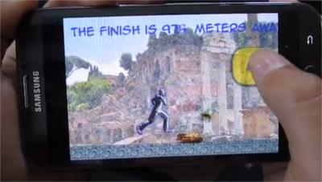
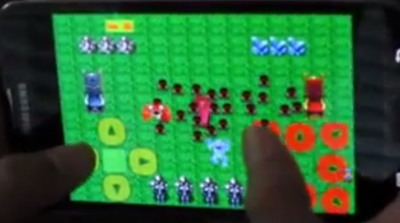

PyChildren - Teaching Children to Program in Python
===================================================

Target: Age 12 to 15 

About: This is written with one student in mind, my son.  He is currently 14
years old.  I am not a teacher or a programmer.  I am just a dad that
wanted to hang out with his kids and help them to create fun and cool
toys to play with.  I learned Python specifically to teach my children
and have no training.  This is our path.

The Oda Family Teaching Philosophy / Strategy
---------------------------------------------
Heavy on repetition.  Light on theory.

Avoid Scratch and Alice if child is older than 12.  Teach them to type.
Use a text editor or IDE, the same tool professionals use.  Avoid sandbox
environments designed specifically to teach children.    My son uses
Komodo Edit.  I use Emacs and PyCharm.  This is my personal 
philosophy based on my own experience teaching my own child to 
program.  Choose your own path.

Change in Direction
-------------------
When my son was 12, he broke the screen of his cheap mobile phone 
during cross country.  I let him suffer with his broken screen for a year
and then finally bought him a used Android phone on eBay for $40,
including shipping.  That first phone was a LG Optimus S with Android
2.2.  It was the first Android phone in our family.  My wife and I
were previously iPhone people.

That old, slow Android phone started us down the path of mobile 
app development using Pygame Subset for Android (pgs4a).  It
was the breakthrough moment.  It allowed him to share his games
with his friends and our family.  It provided the motivation to
keep going.  Our family curriculum is now based around pgs4a.

The Oda Path
------------

### Group One 
Six modules that must be done in sequence.

1. The Blank Screen

2. The Stationary Square

3. The Moving Square

4. Touchscreen movement

5. Going Mobile - Getting your app on your Android phone

* Adding Android-specific code
* Configuring pgs4a
* Loading the app onto your phone with a USB cable

6. Putting it all together - Adding graphics and a virtual controller

###Group 2 
Two suggested modules are 2D scroller movement of the ground/background
and character animation of the running man.

1. 2D ground scroller basic

2. Pygame character animation

### Group 3
Many different paths.  Pick your own

1. 2D Tile map basic. No loader. Map doesn't scroll (see Swarm game)

2. Tiled 2D tile map creation in JSON format

3. Building the json loader to get the map onto the phone

Except for Swarm, there are video tutorials for all the lesson blocks. Each of the eleven lesson blocks above is more than one day of lessons. Assuming one class per week, the JSON loader lesson could take months to complete.

PyChildren - Oda Path Age 11 - 14
---------------------------------

Blog for teaching children Python programming.  http://pychildren.blogspot.com

* [PyChildren github Code Repository of Lessons](https://github.com/codetricity/pychildren)
* [PyChildren YouTube Channel with tutorials](https://www.youtube.com/user/surfkidsdad/) 
* [PyChildren Blog](http://pychildren.blogspot.com)

## Tutorials
### Lesson 1, The Blank Screen

### Lesson 2, The Stationary Square

### Lesson 3, The Moving Square

### Lesson 4, Touchscreen Movement

