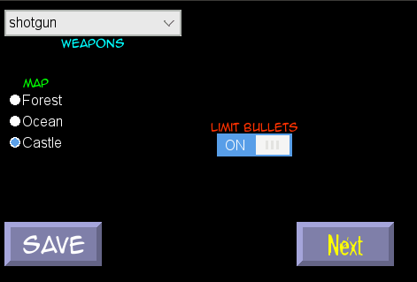

# Pygame, Python lesson written by 14 year old boy.

Uses SGC http://program.sambull.org/sgc/index.html

https://launchpad.net/simplegc

This lesson requires:

- python 2.7
- pygame
- sgc GUI toolkit for Pygame

It should run on Android with minor modifications.

Concepts covered

- write to file
- event handling
- simple classes and functions
